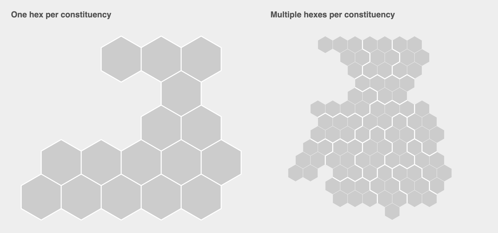

# Senedd 2026 Hexmaps

This page shows two hexmaps of the Senedd 2026 constituencies, the first where each constituency is represented by a single hexagon, and the second where each constituency is represented by six hexagons (one for each seat in the constituency).

## Data

The Hexjson data files are available below:

- [senedd_2026.hexjson](data/senedd_2026.hexjson) - One hex per constituency
- [senedd_2026_multiple.hexjson](data/senedd_2026_multiple.hexjson) - Multiple hexes per constituency

To view the hexmaps, simply open `index.html` in your web browser.
