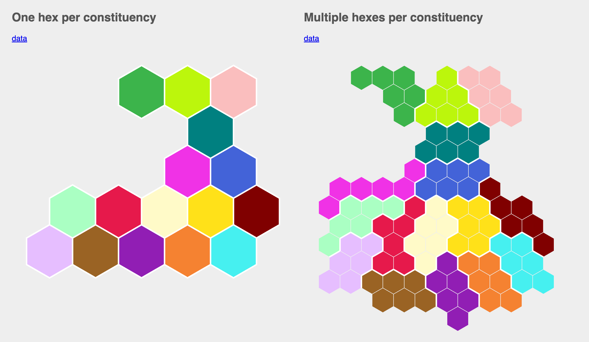
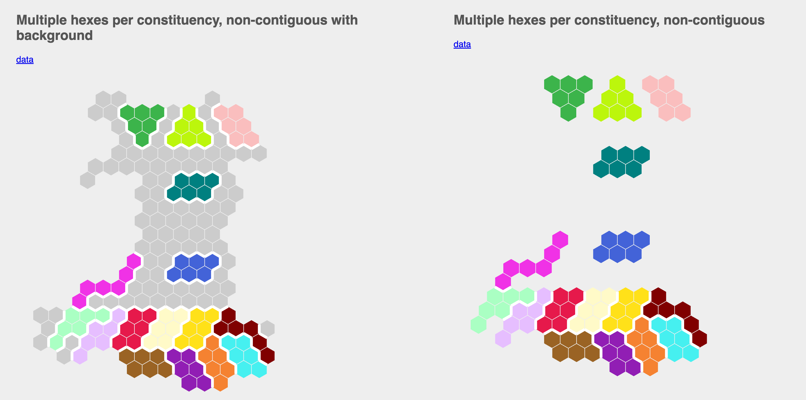

# Senedd 2026 Hexmaps

This page shows four hexmaps of the Senedd 2026 constituencies:

1. Each constituency is represented by a single hexagon
2. Each constituency is represented by six hexagons (one for each seat in the constituency)
3. Each constituency is represented by six hexagons (one for each seat in the constituency), these are non-contiguous, with background hexes to maintain visual coherence and a 'sense' of Wales
4. Each constituency is represented by six hexagons (one for each seat in the constituency), these are non-contiguous, but no background hexes are present

## Data

The Hexjson data files are available below:

- [senedd_2026.hexjson](data/senedd_2026.hexjson) - One hex per constituency
- [senedd_2026_multiple.hexjson](data/senedd_2026_multiple.hexjson) - Multiple hexes per constituency
- [senedd_2026_multiple_nc.hexjson](data/senedd_2026_multiple_nc.hexjson) - Multiple hexes per constituency, non-contiguous
- [senedd_2026_multiple_nc_with_background.hexjson](data/senedd_2026_multiple_nc_with_background.hexjson) - Multiple hexes per constituency, non-contiguous, with background hexes to maintain visual coherence

To view the hexmaps, simply open `index.html` in your web browser.
